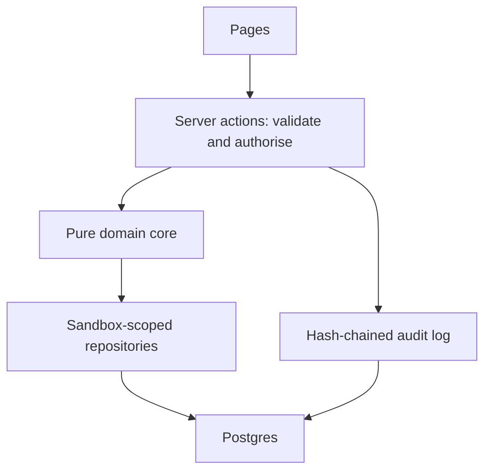

# Atlas

Atlas is a marketplace prototype where shareholders sell existing shares in fictional private UAE startups to professional investors. The company verifies holdings, sets transfer rules and approves every transfer; no new shares are issued and the startup raises no money. It was built for the Greenstone Intern, Technology interview task, with fictional companies and people and a private demo sandbox for each visitor.

<!-- DEMO_URL -->

## Try it

1. Open the landing page and pick a role; no sign-up is needed.
2. As Buyer A, discover Falaj Robotics, inspect the prices and answer the seeded counter.
3. As Seller, open L-2031 from Holdings; bids stay sealed until its window closes.
4. Use the toolbar's +1, +7 or +30 days controls to move sandbox time.
5. Leave auto-pilot on for simulated counterparties, or turn it off and switch roles to act yourself.
6. Start the guided tour for eight linked steps; Reset restores your sandbox at any time.

## Local setup

Use Node.js 24 (see `.nvmrc`) and pnpm 11.15.1. Read `AGENTS.md` before contributing.

```sh
pnpm install --frozen-lockfile
cp .env.example .env.local
openssl rand -base64 48
```

In `.env.local`, set `DATABASE_URL=pglite://.pglite/dev` and paste the generated value as `SESSION_SECRET`. PGlite is Postgres running in-process: no database account is needed. `pglite://memory` is available for isolated tests; `postgres://` and `postgresql://` select the Neon WebSocket driver. Do not commit environment files.

```sh
pnpm dev
```

Open http://localhost:3000. Persistent PGlite directories automatically migrate on first use. `pnpm db:reset-local` removes local databases, including their demo changes. `/dev/ui` is available only in development and always returns HTTP 404 in production, even if the old `ATLAS_DEV_UI` flag is set. The E2E suite retains its showcase checks on a separate development server.

`NEXT_PUBLIC_REPO_URL` is optional and links Under the hood to a public repository and its build log. It is not a secret.

## Architecture



- One Next.js app; business rules in pure TypeScript.
- Every change is a server action that validates, authorises and writes an audit entry in one transaction.
- Money is integer minor units; no floating point.
- Each visitor gets an isolated sandbox with its own clock.
- Simulated counterparties use the same state transitions as people.

Pages read display-ready models. Writes lock the sandbox, check optimistic versions and apply the domain transition's ordered effects in the same transaction. Lazy refresh processes deadlines at their effective times and runs concrete-user auto-pilot jobs. A signed httpOnly session identifies the sandbox and persona. No per-visitor data is cached.

## Security model

| Threat | Control | Where to see it |
| --- | --- | --- |
| Fake holdings | Company verification | Company console |
| Double-selling | Reservations and database CHECK | Holdings |
| Shill bidding | Beneficial-owner related-party block | Under the hood / bid policy |
| Wash trades | Related-party prints excluded | Company chart |
| Bid leakage | Public projections and sealed bids | Live listing |
| Wire fraud | Locked instructions and payment-message warnings | Trade room |
| Buyer default | Funding deadline and backup bid | Trade room / listing |
| Account takeover | Simulated passkey step-up | Trade room |
| Insider abuse | Two operators and checkpointed hash chain | Trade room / audit log |
| Malicious uploads | Described only: production would scan and watermark uploads | Under the hood |

Every page uses a fresh nonce-based Content-Security-Policy. Inline scripts require a nonce; inline styles remain permitted for charts and diagrams. Security headers block framing and MIME sniffing and request `noindex, nofollow`. The passkey, bank account and documents are explicitly demo simulations. The audit tamper tool is an operator-only demonstration of detection, not a production feature.

## Testing

Run build-owning commands sequentially: `pnpm check`, then `pnpm test:e2e`, then smoke. Never run check, build or E2E together because they share `.next`.

| Command | Coverage |
| --- | --- |
| `pnpm check` | Tokens, TypeScript, Biome, coverage-gated tests and production build |
| `pnpm test` / `pnpm test:coverage` | Pure domain properties, component checks and in-memory PGlite integration scenarios |
| `pnpm exec playwright install chromium` | Install the browser before the first E2E run |
| `pnpm test:e2e` | Product flows, auto-pilot, isolation, keyboard/mobile/themes, CSP and axe accessibility |
| `pnpm audit --prod --audit-level high` | Production dependency advisories; CI blocks high/critical |
| `pnpm db:generate` | Generate migrations; CI checks for migration drift |
| `pnpm db:migrate` | Apply committed migrations to the selected driver |
| `pnpm db:smoke` | SELECT 1 and interactive transaction; prints the driver |
| `SMOKE_URL=https://<project>.vercel.app pnpm test:smoke` | Read-mostly post-deploy flow, headers, charts, audit verification and diagrams |

For local smoke, run `pnpm build`, then start `pnpm start -p 3300` with `ATLAS_DEV_UI` unset and valid local database/session variables. In another terminal run `SMOKE_URL=http://localhost:3300 pnpm test:smoke`. The smoke suite never submits bids, tampers or moves money; persona switches and audit verification run in its own visitor sandbox.

Domain/lib coverage thresholds are unchanged; server coverage is reported separately. CI runs migration drift, the production audit, full check and E2E sequentially. The production build does not need a live database.

## Deploy

1. **Neon:** create a project in AWS Frankfurt, database `atlas`; copy the **pooled** connection string.
2. **Locally:** run `DATABASE_URL="<neon url>" pnpm db:migrate`, then `DATABASE_URL="<neon url>" pnpm db:smoke`. Keep the URL out of Git and shared logs.
3. **Vercel:** import the GitHub repository; select Next.js. Set `DATABASE_URL` to the Neon URL, `SESSION_SECRET` to a new `openssl rand -base64 48` value different from local, and `NEXT_PUBLIC_REPO_URL` to the repository URL if public. Do **not** set `ATLAS_DEV_UI`. Deploy. `vercel.json` selects `fra1`; `engines.node` pins Node 24.
4. Run `SMOKE_URL=https://<project>.vercel.app pnpm test:smoke`.
5. Open the URL in a private window on desktop and phone: no login prompt; the landing page loads.

Migrations are explicit for Neon and automatic only for PGlite. Preview and production environments must receive their own intended database URL and session secret. The Neon driver reuses one small module-level WebSocket Pool with short idle timeouts for interactive transactions.

## Repository layout

```text
src/app/             Pages, loading states and thin action facades
src/components/      Atlas primitives, shell and Radix UI components
src/domain/          Pure transition tables, policy, allocation, pricing and audit
src/server/          Actions, read models, repositories, sandboxes and auto-pilot
src/lib/             Formatting and pure display/security helpers
src/styles/          Atlas CSS and generated design tokens
scripts/             Token generation, database migrations and smoke

drizzle/             Generated PostgreSQL migrations

tests/unit/          Unit, component and guard tests
tests/integration/   Isolated PGlite scenarios
tests/e2e/           Full product/browser and accessibility checks
tests/smoke/         Read-mostly deployed checks
prompts/reports/     Segment verification and decisions
docs/design/         Approved design reference (read-only)
```

## AI and tools

The project was implemented in discrete, reviewable segments using the supplied prompts, local development tools and automated checks. [docs/BUILD-LOG.md](docs/BUILD-LOG.md) records what each segment built, its verification and documented deviations. Ahmed supplies the separate AI disclosure.
